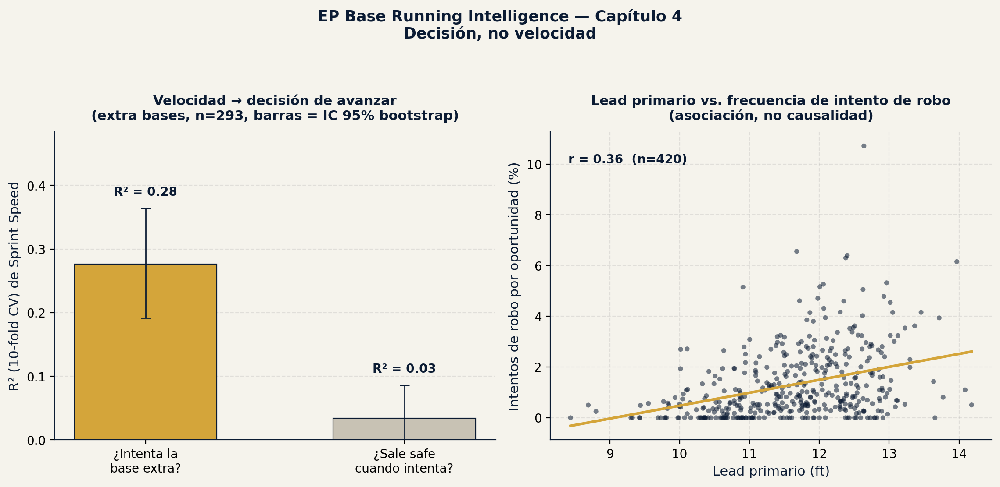

# EP Base Running Intelligence

*[English version](README_EN.md)*

Proyecto de EP (Emerson Performance) — analítica de corrido de bases usando
datos 100% reales y públicos de Baseball Savant, temporada 2026. Mismo
enfoque metodológico que [EP Swing Intelligence](https://github.com/emersonjp2412-jpg/ep-swing-intelligence),
aplicado a una habilidad distinta: velocidad y toma de decisiones en las
bases.

## Pregunta central

¿Qué tan bien predice la **velocidad física pura** (Sprint Speed, tiempo
Home-to-First) el **valor real de corrido de bases** que ya calcula
Savant? Y, más interesante todavía: ¿la velocidad predice igual de bien
distintas habilidades de corrido de bases, o hay diferencias grandes entre
ellas?

## Datos

Cinco descargas públicas de Baseball Savant (leaderboards de "Running"),
temporada 2026, sin selección de jugadores de nuestra parte — población
completa calificada:

| Archivo | n | Contenido |
|---|---|---|
| `data/sprint_speed.csv` | 513 | Sprint Speed (ft/seg), Home-to-First (seg) — variables físicas |
| `data/baserunning_run_value.csv` | 228 | Baserunning Run Value real de Savant (general) |
| `data/base_running.csv` | 298 | Valor de avanzar extra bases (1ra→3ra, etc.) |
| `data/basestealing_running_game.csv` | 420 | Valor de robo de bases, leads primario/secundario |
| `data/running_splits.csv` | 482 | Splits de tiempo cada 5 pies desde el batazo hasta 90 pies |

Todos cruzados por `player_id`, sin transcripción manual — descarga
directa en CSV desde Savant.

## Resultado (capítulo 1)

Modelo de regresión lineal con validación cruzada de 10 folds
(`sprint_speed` + `hp_to_1b` → valor real, normalizado por oportunidades
para evitar sesgo por tiempo de juego):

| Habilidad | n | R² |
|---|---|---|
| Baserunning Run Value (general) | 227 | **0.41** |
| Extra bases tomadas (1ra→3ra, etc.) | 298 | **0.48** |
| Robo de bases exitoso | 406 | **0.04** |


### La lectura honesta

La velocidad pura explica casi la mitad de la varianza en **avance de
extra bases** — tiene sentido, es una decisión física directa: el corredor
ve la pelota, corre, y la velocidad domina el resultado.

Pero para el **robo de bases exitoso**, la velocidad explica prácticamente
nada (R²=0.04). Esto no es un error del modelo — es un hallazgo real: robar
una base depende de la lectura del "jump" contra el pitcher, tendencias de
conteo, el brazo del catcher rival, y timing — variables de decisión y
anticipación que sprint speed no captura, aunque intuitivamente parezca
que "el más rápido roba más bases".

**Para contexto de coaching:** esto separa dos habilidades entrenables de
forma distinta. Sprint speed (mecánica lineal, fuerza, técnica de
aceleración) es el terreno clásico de un S&C Coach. El robo de bases
exitoso depende más de lectura de juego y timing — trabajo de scouting y
repetición situacional, no solo de correr más rápido.

## Resultado (capítulo 2)

Capítulo 1 dejó una pregunta abierta: si la velocidad máxima no predice el
robo de bases exitoso, ¿es porque ninguna parte de la carrera importa, o
es específicamente porque el robo depende del **arranque** ("jump") y no
de la velocidad de crucero?

Usamos `running_splits.csv` (tiempo cada 5 pies desde el batazo) para
descomponer la carrera en tres fases y medir la velocidad promedio
(ft/seg) de cada una:

- **Burst (0-10 ft):** primeros pasos, arranque/reacción
- **Aceleración (10-45 ft):** fase de aceleración
- **Velocidad tope (45-90 ft):** velocidad de crucero sostenida

Regresión lineal, validación cruzada de 10 folds, cada fase probada por
separado y las tres juntas (n=179, jugadores con las tres fuentes de datos
cruzadas y mínimo 3 intentos de robo):

| Habilidad | Burst (0-10ft) | Aceleración (10-45ft) | Vel. tope (45-90ft) | Las 3 fases juntas |
|---|---|---|---|---|
| Baserunning Run Value (total) | 0.12 | **0.32** | 0.29 | 0.33 |
| Extra bases (tasa de éxito) | 0.01 | 0.10 | **0.11** | 0.10 |
| Robo de bases (tasa de éxito) | 0.01 | 0.01 | 0.00 | -0.01 |


### La lectura honesta

La hipótesis de este capítulo era que el robo de bases se explicaría por
el **burst** (el "jump" inicial) aunque no por la velocidad tope. **Esa
hipótesis no se sostuvo.** Ninguna fase de la carrera —ni arranque, ni
aceleración, ni velocidad de crucero— predice el éxito en el robo de
bases. El R² se mantiene prácticamente en cero en las tres fases y hasta
se vuelve negativo al combinarlas.

Esto es un hallazgo más fuerte que el del capítulo 1, no más débil: no es
que "la velocidad máxima no alcanza a explicarlo" — es que **ninguna
métrica de velocidad, medida en ningún punto de la carrera, explica el
robo de bases exitoso**. Refuerza que es una habilidad de lectura y
decisión (timing contra el pitcher, tendencias de conteo, brazo del
catcher) prácticamente independiente de qué tan rápido corre el jugador.

Para el valor general de corrido de bases y para extra bases, la fase de
**aceleración (10-45 ft)** explica tanto o más que la velocidad tope —
sugiere que gran parte del valor real viene de qué tan rápido el corredor
alcanza velocidad útil, no solo de su techo de velocidad máxima.

**Para contexto de coaching:** si el objetivo es mejorar el corrido de
bases general o el avance de extra bases, trabajar la fase de aceleración
(los primeros 10-45 pies) tiene tanto o más impacto que perseguir
velocidad máxima pura. Para robo de bases, ningún trabajo de velocidad va
a mover la aguja — es terreno de scouting y repetición situacional.

## Resultado (capítulo 3)

Los capítulos 1 y 2 trataron a todos los corredores como una sola
población. Pero, ¿la velocidad predice el valor de corrido de bases igual
para un infielder que para un outfielder? Separamos por posición
(infielders: 1B/2B/3B/SS; outfielders: LF/CF/RF; catchers y DH aparte) y
repetimos ambos análisis dentro de cada grupo.

Catchers (n=11) y DH (n=13) quedaron con muestra insuficiente para
regresión confiable tras el cruce con datos reales — se reportan solo de
forma descriptiva, sin modelo.

| Posición | n | R² Sprint Speed → valor | Vel. promedio (ft/seg) |
|---|---|---|---|
| Infielders | 115 | **0.45** | 27.44 |
| Outfielders | 88 | **0.24** | 28.21 |

| Posición | n | R² Burst | R² Aceleración | R² Vel. tope |
|---|---|---|---|---|
| Infielders | 127 | 0.12 | **0.42** | 0.41 |
| Outfielders | 94 | 0.04 | 0.24 | 0.17 |


### La lectura honesta

La velocidad explica casi el doble de la varianza del valor de corrido de
bases en infielders que en outfielders — a pesar de que los outfielders
son, en promedio, más rápidos. Esto no es contradictorio: entre
outfielders casi todos ya corren rápido (el grupo es más homogéneo en
velocidad), así que la velocidad deja de ser lo que distingue a un buen
corredor de uno promedio dentro de ese grupo. Lo que probablemente marca
la diferencia ahí es lectura de juego y toma de decisiones — coincide con
el patrón que ya vimos en el capítulo 2 para el robo de bases.

Para infielders, en cambio, sprint speed y las fases de aceleración/tope
explican una porción mucho mayor del valor real (R²=0.42-0.45) — el techo
físico sigue siendo el factor dominante en este grupo.

**Para contexto de coaching:** invertir en trabajo de velocidad pura tiene
mayor retorno esperado en infielders que en outfielders. Para
outfielders, que ya suelen tener buena velocidad de base, el margen de
mejora en corrido de bases probablemente está más en el trabajo de
lectura y decisión situacional que en seguir puliendo velocidad.

## Resultado (capítulo 4)

Los capítulos 1-3 midieron cuánto explica la velocidad del *valor* de
corrido de bases. Pero avanzar una base extra implica dos decisiones
distintas: **si intentar** y **si salir safe al intentar**. ¿La velocidad
predice ambas por igual? Y en el robo de bases: ¿cómo se relacionan los
leads con la frecuencia y el éxito de los intentos, una vez considerada la
velocidad?

**A. Extra bases: intentar vs. salir safe** (n=293; mínimo 30 oportunidades
y 10 intentos por jugador; misma muestra para ambas preguntas)

| Pregunta | R² (10-fold CV) | IC 95% bootstrap |
|---|---|---|
| ¿Intenta la base extra? (tasa de intento) | **0.28** | 0.19 – 0.36 |
| ¿Sale safe cuando intenta? | **0.03** | -0.01 – 0.09 |

Con umbrales de 5 a 20 intentos mínimos el patrón se mantiene (R² de
intento 0.22-0.28; R² de safe por intento 0.02-0.03).

**B. Leads y robo de bases** (población calificada con lead disponible)

| Relación | r | n | p |
|---|---|---|---|
| Sprint Speed ↔ lead primario | 0.46 | 420 | < 0.001 |
| Sprint Speed ↔ lead secundario | 0.39 | 420 | < 0.001 |
| Lead primario ↔ tasa de intento de robo | 0.36 | 420 | < 0.001 |
| Lead secundario ↔ tasa de intento de robo | 0.42 | 420 | < 0.001 |
| Lead primario ↔ % de éxito del robo (≥ 8 intentos) | 0.06 | 99 | 0.58 |
| Lead secundario ↔ % de éxito del robo (≥ 8 intentos) | 0.05 | 99 | 0.59 |

Modelo de tasa de intento de robo (R² 10-fold CV, IC 95% bootstrap):
solo velocidad **0.35** (0.29-0.42); velocidad + lead primario **0.35**
(0.30-0.43); velocidad + ambos leads **0.39** (0.33-0.46).



### La lectura honesta

**CONFIRMED (en estos datos):**
- La velocidad explica bastante **quién intenta** la base extra (R² 0.28) y
  muy poco **quién sale safe cuando intenta** (R² 0.03). La relación con el
  éxito por intento no es cero (r = 0.21, p < 0.001), pero es pequeña.
- Los corredores más rápidos toman leads más largos (r = 0.46), y los leads
  más largos se asocian con más intentos de robo.
- El lead **no** se asocia con el porcentaje de éxito del robo (n = 99,
  r ≈ 0.05, p ≈ 0.6).
- Agregar ambos leads a la velocidad sube el R² de la tasa de intento de
  0.35 a 0.39, pero los intervalos se solapan bastante: mejora modesta, no
  concluyente.

**INTERPRETATION (hipótesis, no probada aquí):**
- La velocidad y el lead que la acompaña parecen moldear la *disposición a
  intentar*, más que la *calidad de la decisión*. Es consistente con los
  capítulos 2 y 3, pero estos datos no lo prueban.
- Para coaching, esto sugiere que entrenar velocidad no mueve por sí solo
  el "salir safe", y que la calidad de decisión hay que medirla aparte.

**Limitaciones:**
- Una sola temporada (2026) y datos agregados de Savant, sin contexto por
  jugada (conteo, pitcher, receptor, marcador).
- Quien intenta no lo hace al azar: suele elegir situaciones favorables, lo
  que comprime la variación del porcentaje de éxito (promedio ≈ 80% en
  robos con ≥ 8 intentos).
- El lead es una elección del propio corredor (quien planea correr suele
  alejarse más), así que las asociaciones **no** prueban que un lead mayor
  cause más intentos.
- Los umbrales mínimos de intentos son decisiones del análisis; se reporta
  la sensibilidad en `model/baserunning_model_ch4_metrics.json`.

## Cómo reproducir

```bash
pip install -r requirements.txt
python3 model/train_baserunning_model.py       # capítulo 1
python3 model/train_baserunning_model_ch2.py   # capítulo 2
python3 model/train_baserunning_model_ch3.py   # capítulo 3
python3 model/train_baserunning_model_ch4.py   # capítulo 4
```

Cada script genera su archivo de métricas en `model/`
(`baserunning_model_metrics.json`, `..._ch2_metrics.json`,
`..._ch3_metrics.json`, `..._ch4_metrics.json`), su gráfico en `report/` y
su dataset cruzado en `data/` (`merged_baserunning_dataset_*.csv`).

## Próximos pasos (no incluidos en estos capítulos)

- Medir calidad de decisión ajustada por situación (conteo, pitcher,
  receptor, marcador): requiere datos por jugada, no los agregados de
  leaderboard, y más de una temporada
- Aislar corredores de elite ("bolts", sprints por encima de un umbral) del resto
- Triangular con literatura de biomecánica de sprint (aceleración lineal vs.
  agilidad/cambio de dirección), con fuentes verificadas
- Convertir los hallazgos en una hoja de una página para coaches (perfil de
  corredor de ejemplo), presentada como demostración

## Sobre EP

Parte del portafolio de **Emerson Performance (EP)** — metodología de
analítica de rendimiento en béisbol que combina datos públicos de Savant,
biomecánica, y trabajo de campo como Strength & Conditioning Coach.
