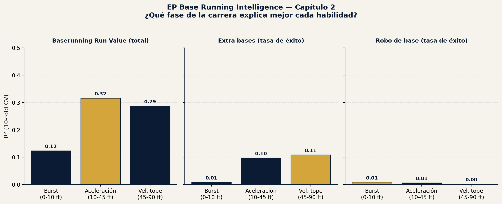
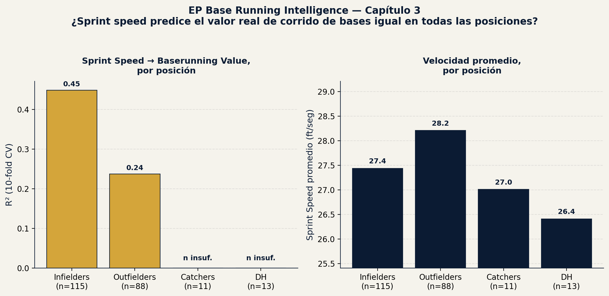

# EP Base Running Intelligence

EP (Emerson Performance) project — base running analytics using 100% real,
public Baseball Savant data, 2026 season. Same methodology as
[EP Swing Intelligence](https://github.com/ejimenezperformance/ep-swing-intelligence),
applied to a different skill: speed and decision-making on the bases.

*[Versión en español](README.md)*

## Core question

How well does **raw physical speed** (Sprint Speed, Home-to-First time)
predict the **real base running value** Savant already calculates? And,
more interesting: does speed predict different base-running skills
equally well, or are there large differences between them?

## Data

Five public Baseball Savant downloads ("Running" leaderboards), 2026
season, no player selection on our part — full qualified population:

| File | n | Content |
|---|---|---|
| `data/sprint_speed.csv` | 513 | Sprint Speed (ft/sec), Home-to-First (sec) — physical variables |
| `data/baserunning_run_value.csv` | 228 | Savant's real Baserunning Run Value (overall) |
| `data/base_running.csv` | 298 | Value of taking extra bases (1st→3rd, etc.) |
| `data/basestealing_running_game.csv` | 420 | Stolen base value, primary/secondary leads |
| `data/running_splits.csv` | 482 | Time splits every 5 feet from contact to 90 feet |

All merged by `player_id`, no manual transcription — direct CSV download
from Savant.

## Result (chapter 1)

Linear regression with 10-fold cross-validation (`sprint_speed` +
`hp_to_1b` → real value, normalized by opportunities to avoid confounding
with playing time):

| Skill | n | R² |
|---|---|---|
| Baserunning Run Value (overall) | 227 | **0.41** |
| Extra bases taken (1st→3rd, etc.) | 298 | **0.48** |
| Successful stolen base | 406 | **0.04** |


### The honest read

Raw speed explains nearly half the variance in **taking extra bases** —
makes sense, it's a direct physical decision: the runner sees the ball,
runs, and speed dominates the outcome.

But for **successful stolen bases**, speed explains almost nothing
(R²=0.04). This isn't a model error — it's a real finding: stealing a base
depends on reading the "jump" against the pitcher, count tendencies, the
opposing catcher's arm, and timing — decision and anticipation variables
that sprint speed doesn't capture, even though intuition says "the fastest
runner steals the most bases."

**For coaching context:** this separates two skills that get trained
differently. Sprint speed (linear mechanics, strength, acceleration
technique) is classic Strength & Conditioning territory. Successful base
stealing depends more on game reading and timing — scouting and
situational-repetition work, not just running faster.

## Result (chapter 2)

Chapter 1 left an open question: if top speed doesn't predict successful
stolen bases, is it because no part of the sprint matters, or specifically
because stealing depends on the **burst** ("the jump") rather than cruise
speed?

We used `running_splits.csv` (time at every 5 feet from contact) to break
the sprint into three phases and measure average velocity (ft/sec) in
each:

- **Burst (0-10 ft):** first steps, reaction/start
- **Acceleration (10-45 ft):** acceleration phase
- **Top speed (45-90 ft):** sustained cruise speed

Linear regression, 10-fold cross-validation, each phase tested alone and
all three together (n=179, players with all three data sources merged
and a minimum of 3 stolen-base attempts):

| Skill | Burst (0-10ft) | Acceleration (10-45ft) | Top speed (45-90ft) | All 3 phases |
|---|---|---|---|---|
| Baserunning Run Value (total) | 0.12 | **0.32** | 0.29 | 0.33 |
| Extra bases (success rate) | 0.01 | 0.10 | **0.11** | 0.10 |
| Stolen bases (success rate) | 0.01 | 0.01 | 0.00 | -0.01 |



### The honest read

This chapter's hypothesis was that stolen-base success would be explained
by the **burst** (the initial "jump"), even if not by top speed. **That
hypothesis did not hold.** No phase of the sprint — not burst, not
acceleration, not cruise speed — predicts stolen-base success. R² stays
essentially at zero across all three phases and even turns negative when
combined.

This is a stronger finding than chapter 1's, not a weaker one: it's not
that "top speed alone falls short of explaining it" — it's that **no
speed metric, measured at any point in the sprint, explains successful
base stealing**. It reinforces that this is a reading-and-decision skill
(timing against the pitcher, count tendencies, catcher's arm) almost
entirely independent of how fast the runner actually is.

For overall base-running value and for extra bases, the **acceleration
phase (10-45 ft)** explains as much or more than top speed — suggesting
much of the real value comes from how quickly a runner reaches useful
speed, not just their maximum ceiling.

**For coaching context:** if the goal is improving overall base running
or extra-base advancement, training the acceleration phase (the first
10-45 feet) has as much or more impact than chasing pure top speed. For
stolen bases, no speed work is going to move the needle — that's scouting
and situational-repetition territory.

## Result (chapter 3)

Chapters 1 and 2 treated all runners as a single population. But does
speed predict base-running value equally for an infielder and an
outfielder? We split by position (infielders: 1B/2B/3B/SS; outfielders:
LF/CF/RF; catchers and DH separately) and re-ran both analyses within
each group.

Catchers (n=11) and DH (n=13) ended up with insufficient sample for
reliable regression after merging with real data — they're reported
descriptively only, with no model fit.

| Position | n | R² Sprint Speed → value | Avg. speed (ft/sec) |
|---|---|---|---|
| Infielders | 115 | **0.45** | 27.44 |
| Outfielders | 88 | **0.24** | 28.21 |

| Position | n | R² Burst | R² Acceleration | R² Top speed |
|---|---|---|---|---|
| Infielders | 127 | 0.12 | **0.42** | 0.41 |
| Outfielders | 94 | 0.04 | 0.24 | 0.17 |



### The honest read

Speed explains nearly twice as much of the variance in base-running
value for infielders as for outfielders — even though outfielders are,
on average, faster. This isn't contradictory: among outfielders, almost
everyone already runs fast (the group is more homogeneous in speed), so
speed stops being what separates a good baserunner from an average one
within that group. What likely drives the difference there is game
reading and decision-making — consistent with the pattern we already saw
in chapter 2 for stolen bases.

For infielders, on the other hand, sprint speed and the
acceleration/top-speed phases explain a much larger share of real value
(R²=0.42-0.45) — the physical ceiling remains the dominant factor in
this group.

**For coaching context:** investing in pure speed work has a higher
expected return for infielders than for outfielders. For outfielders,
who typically already have solid baseline speed, the room for
improvement in base running is more likely in situational reading and
decision-making work than in further polishing speed.

## Result (chapter 4)

Chapters 1-3 measured how much speed explains baserunning *value*. But
taking an extra base involves two separate decisions: **whether to
attempt** and **whether to be safe once attempting**. Does speed predict
both equally? And for stealing: how do leads relate to attempt frequency
and success once speed is accounted for?

**A. Extra bases: attempting vs. being safe** (n=293; minimum 30
opportunities and 10 attempts per player; same sample for both questions)

| Question | R² (10-fold CV) | 95% bootstrap CI |
|---|---|---|
| Does he attempt the extra base? (attempt rate) | **0.28** | 0.19 – 0.36 |
| Is he safe when he attempts? | **0.03** | -0.01 – 0.09 |

With minimum-attempt thresholds from 5 to 20 the pattern holds (attempt
R² 0.22-0.28; safe-per-attempt R² 0.02-0.03).

**B. Leads and stolen bases** (qualified population with lead data)

| Relationship | r | n | p |
|---|---|---|---|
| Sprint Speed ↔ primary lead | 0.46 | 420 | < 0.001 |
| Sprint Speed ↔ secondary lead | 0.39 | 420 | < 0.001 |
| Primary lead ↔ steal attempt rate | 0.36 | 420 | < 0.001 |
| Secondary lead ↔ steal attempt rate | 0.42 | 420 | < 0.001 |
| Primary lead ↔ steal success % (≥ 8 attempts) | 0.06 | 99 | 0.58 |
| Secondary lead ↔ steal success % (≥ 8 attempts) | 0.05 | 99 | 0.59 |

Steal attempt-rate model (10-fold CV R², 95% bootstrap CI): speed only
**0.35** (0.29-0.42); speed + primary lead **0.35** (0.30-0.43); speed +
both leads **0.39** (0.33-0.46).


### The honest read

**CONFIRMED (in this data):**
- Speed explains a good amount of **who attempts** the extra base (R² 0.28)
  and very little of **who is safe when attempting** (R² 0.03). The link
  with per-attempt success is not zero (r = 0.21, p < 0.001) but it is
  small.
- Faster runners take longer leads (r = 0.46), and longer leads are
  associated with more steal attempts.
- Lead is **not** associated with steal success percentage (n = 99,
  r ≈ 0.05, p ≈ 0.6).
- Adding both leads to speed raises attempt-rate R² from 0.35 to 0.39, but
  the intervals overlap considerably: a modest, inconclusive gain.

**INTERPRETATION (hypothesis, not proven here):**
- Speed and the lead that comes with it seem to shape *willingness to
  attempt* more than *decision quality*. This is consistent with chapters
  2 and 3, but this data does not prove it.
- For coaching, this suggests that training speed alone does not move
  "being safe," and that decision quality has to be measured separately.

**Limitations:**
- One season (2026) and aggregated Savant data, with no play-level context
  (count, pitcher, catcher, score).
- Attempts are not random: runners tend to pick favorable situations, which
  compresses variation in success percentage (mean ≈ 80% among steals with
  ≥ 8 attempts).
- Lead is the runner's own choice (someone planning to run tends to lead
  off farther), so these associations do **not** show that a longer lead
  causes more attempts.
- The minimum-attempt thresholds are analysis choices; sensitivity is
  reported in `model/baserunning_model_ch4_metrics.json`.

## How to reproduce

```bash
pip install -r requirements.txt
python3 model/train_baserunning_model.py       # chapter 1
python3 model/train_baserunning_model_ch2.py   # chapter 2
python3 model/train_baserunning_model_ch3.py   # chapter 3
python3 model/train_baserunning_model_ch4.py   # chapter 4
```

Each script writes its metrics file to `model/`
(`baserunning_model_metrics.json`, `..._ch2_metrics.json`,
`..._ch3_metrics.json`, `..._ch4_metrics.json`), its chart to `report/`, and
its merged dataset to `data/` (`merged_baserunning_dataset_*.csv`).

## Next steps (not included in these chapters)

- Measure situation-adjusted decision quality (count, pitcher, catcher,
  score): requires play-level data rather than aggregated leaderboards, and
  more than one season
- Isolate elite runners ("bolts," sprints above a threshold) from the rest
- Triangulate with sprint biomechanics literature (linear acceleration vs.
  agility/change of direction), using verified sources
- Turn the findings into a one-page coach sheet (sample runner profile),
  presented as a demonstration

## About EP

Part of the **Emerson Performance (EP)** portfolio — baseball performance
analytics methodology combining public Savant data, biomechanics, and
field work as a Strength & Conditioning Coach.
