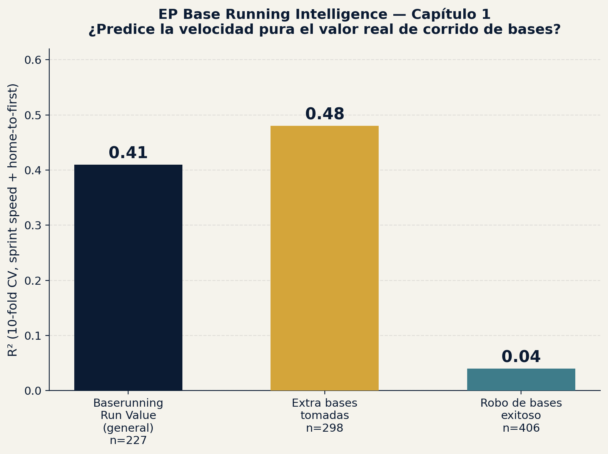

# EP Base Running Intelligence

EP (Emerson Performance) project — base running analytics using 100% real,
public Baseball Savant data, 2026 season. Same methodology as
[EP Swing Intelligence](https://github.com/ejimenezperformance/ep-swing-intelligence),
applied to a different skill: speed and decision-making on the bases.

*[Versión en español](README.md)*

## Core question

How well does **raw physical speed** (Sprint Speed, Home-to-First time)
predict the **real base running value** Savant already calculates? And,
more interesting: does speed predict different base-running skills
equally well, or are there large differences between them?

## Data

Five public Baseball Savant downloads ("Running" leaderboards), 2026
season, no player selection on our part — full qualified population:

| File | n | Content |
|---|---|---|
| `data/sprint_speed.csv` | 513 | Sprint Speed (ft/sec), Home-to-First (sec) — physical variables |
| `data/baserunning_run_value.csv` | 228 | Savant's real Baserunning Run Value (overall) |
| `data/base_running.csv` | 298 | Value of taking extra bases (1st→3rd, etc.) |
| `data/basestealing_running_game.csv` | 420 | Stolen base value, primary/secondary leads |
| `data/running_splits.csv` | 482 | Time splits every 5 feet from contact to 90 feet |

All merged by `player_id`, no manual transcription — direct CSV download
from Savant.

## Result (chapter 1)

Linear regression with 10-fold cross-validation (`sprint_speed` +
`hp_to_1b` → real value, normalized by opportunities to avoid confounding
with playing time):

| Skill | n | R² |
|---|---|---|
| Baserunning Run Value (overall) | 227 | **0.41** |
| Extra bases taken (1st→3rd, etc.) | 298 | **0.48** |
| Successful stolen base | 406 | **0.04** |



### The honest read

Raw speed explains nearly half the variance in **taking extra bases** —
makes sense, it's a direct physical decision: the runner sees the ball,
runs, and speed dominates the outcome.

But for **successful stolen bases**, speed explains almost nothing
(R²=0.04). This isn't a model error — it's a real finding: stealing a base
depends on reading the "jump" against the pitcher, count tendencies, the
opposing catcher's arm, and timing — decision and anticipation variables
that sprint speed doesn't capture, even though intuition says "the fastest
runner steals the most bases."

**For coaching context:** this separates two skills that get trained
differently. Sprint speed (linear mechanics, strength, acceleration
technique) is classic Strength & Conditioning territory. Successful base
stealing depends more on game reading and timing — scouting and
situational-repetition work, not just running faster.

## How to reproduce

```bash
pip install pandas scikit-learn matplotlib
python3 model/train_baserunning_model.py
```

This generates `model/baserunning_model_metrics.json`,
`report/chart_baserunning_scatter.png`, and
`data/merged_baserunning_dataset_2026.csv`.

## Next steps (not included in this chapter)

- Split by position (infielders vs. outfielders vs. catchers)
- Isolate elite runners ("bolts," sprints above a threshold) from the rest
- Cross-reference with `running_splits.csv` (acceleration splits) to see
  which phase of the run (start vs. top speed) explains each skill best
- Triangulate with sprint biomechanics literature (linear acceleration vs.
  agility/change of direction)

## About EP

Part of the **Emerson Performance (EP)** portfolio — baseball performance
analytics methodology combining public Savant data, biomechanics, and
field work as a Strength & Conditioning Coach.
